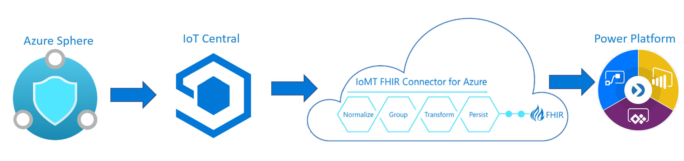

# Pre-requisites

Hardware 

 - A PC running Windows 10 Anniversary Update or later (Version 1607 or greater) 
- An unused USB port on the PC 
- An Avnet Azure Sphere Starter Kit 
- A micro USB cable to connect the Starter Kit to your PC 

Software 

 - Visual Studio 2019 version 16.4 or later (Enterprise, Professional,
   or Community version)  
 - Azure Sphere SDK 20.01 or the current SDK
   release

Others 

- An Azure subscription 
- Power Apps license 

# Architecture

# Workshop Breakdown

## 1. Successful setup of Azure Sphere device

1. Setup an Azure Sphere Tenant  
2.  Access our Azure Sphere Tenant  
3. Update the OS on our Azure Sphere device  
4. Claim our Azure Sphere device to our tenant  
5. Configure the Wi-Fi on our device and verify that it’s connected to a Wi-Fi network  
6. Enable-development mode on device

## 2. Run a program on the Sphere device to extract sensor data and push to IoT Central

 1. Pull an Azure Sphere project down from GitHub  
 2. Review the different build options in the project  
 3. Build and run the project
 4. Create an IoT Central application from a template  
 5. Provision our device to the IoT Central application  
 6. Configure the example application for the IoT Central configuration

## 3. Push data to a FHIR Server
1. Set up IoMT connector to read from IoT Central 
2. Set up Azure API for FHIR c. Send data to Azure API for FHIR

## 4. Visualize sensor data

1. Set up Power App 
2. Visualize temperature sensor data on Power App
